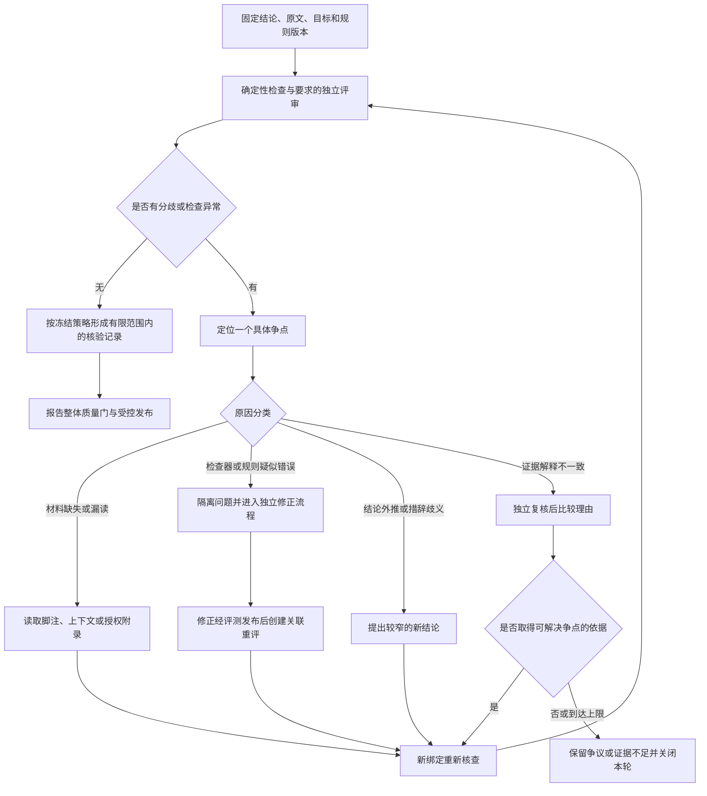

# AgoraHub 论文证据评审与分歧处理 PRD

## 1. 文档信息

| 项目 | 内容 |
| --- | --- |
| OpenSpec change | `research-evidence-review-resolution` |
| 日期 | 2026-09-09 |
| 状态 | Proposed；需求与实施方案，尚未开发 |
| 本轮交付 | PRD、proposal、design、delta specs、待实施任务与文档校验记录 |
| 产品范围 | 单篇论文阅读中的结论核查，以及模型、人工、检查规则之间的分歧 |
| 第一阶段 | 可解释检查、争议复核、误拦纠正、规则版本治理；保持整份正式报告验收 |
| 后续独立范围 | 受限版正式报告、跨论文裁决、科研结论的复现实验平台 |

本文回答一个产品问题：读论文时，如果模型认为某个结论成立，系统检查不通过，而人工又认为系统误判，AgoraHub 怎样找到分歧的原因，并给出可解释的下一步？

## 2. 用户痛点与第一性原理

用户需要读懂论文，并判断原文到底支持哪些结论。如果系统只给“通过/失败”，用户无法知道是自己理解错了、模型外推过度、表格脚注漏读，还是检查规则写得太窄。人工也会遗漏条件，因此“人工一票通过”和“程序永远正确”都不能满足需求。

第一性原理：**判断必须依赖可检查的材料和适用标准；材料处理、评审意见和检查标准都可能出错。分歧处理要寻找能改变判断的证据或错误，而不是按评审者身份选赢家。**

产品目标是让每一次拦截都可以解释和复核。确认误拦时，通过补齐材料、纠正检查或修订结论解除；无法确认时，保留证据不足或争议。运行日志、恢复和提交机制是实现这项能力的保障，不作为阅读论文本身的价值论证。

## 3. 当前实现与能力缺口

以下基线来自本轮对当前 Research 单篇主链的只读核对，不代表全部历史模块或离线评测能力。

| 当前已存在 | 当前尚未接入正式主链 |
| --- | --- |
| `ResearchClaim` 保存文字、类型、证据 ID、置信度等候选数据 | 独立的 claim 修订、评审意见及冲突生命周期 |
| `CitationVerifier` 检查 claim 是否提供引用，以及引用 ID 是否存在于 Evidence Pack | 判断表格和上下文是否真的支持结论的在线复核协议 |
| Graph 的 gate adapter 接入上述检查；运行作用域另有绑定校验 | 人工与模型异议的结构化接纳、补查、重评和关闭 |
| `ResearchQualityGate` 聚合所有 gate，任一必要结果失败则整体不通过 | 区分原文缺信息、解析漏读、检查规则误拦及解释分歧 |
| 后继依赖为 `verify_claims -> quality_gate -> build_reader_payload -> build_paper_card -> publish_artifacts` | 自动生成并正式发布“实验未知、其他部分合格”的受限报告 |
| Harness 控制失败后的有界处理及正式成果提交 | 评审规则的专用申诉、离线修正和关联重评流程 |
| RAG benchmark 记录人工抽查及 judge-human conflict | 将离线标注直接当作在线人工发布授权 |

现有引用检查通过，只说明引用满足该检查的合同，不能宣称语义已核验。token、调用次数和预算属于运行控制，不是证明实验结论成立的依据。必要 gate 失败后的具体终态由现有策略及剩余额度决定，预算耗尽后停止，不能越过失败节点发布。

## 4. 用户、目标与非目标

### 4.1 用户与预期结果

| 使用者 | 需要完成的事情 |
| --- | --- |
| 论文阅读者 | 从一个具体结论回到同版原文，知道哪里有依据、哪里仍有争议 |
| 领域评审者 | 独立提交支持、反驳或缺失条件；可以纠正自己的旧意见 |
| 评审规则维护者 | 复现误拦、验证规则修复，不通过临时放行掩盖检查缺陷 |

### 4.2 第一阶段目标

1. 每条进入正式报告的关键结论都有明确的对象、适用范围、证据及检查要求。
2. 每个拦截能展示具体失败项、所用材料、规则版本和未解决问题。
3. 模型、人工和检查器都可被质疑；纠正要形成新记录，旧结果仍可解释。
4. 通过补齐材料、修正规则、修订结论或独立复核，解决有证据可解的分歧。
5. 无法解决时保留不确定性，既不强行判错，也不靠投票包装成已证实。

### 4.3 非目标

- 不证明论文科学结论在现实中必然正确，不把“论文这样报告”升级为“已经独立复现”。
- 不把第二个模型、人工签名或高自报置信度作为真值来源。
- 不让业务 run 修改 active gate、权限规则或 active skill。
- 第一阶段不发布部分正式报告；可以保留授权可见的候选材料、争议记录和诊断。
- 不扩大现有检索默认部署依赖，不要求引入 Qdrant 或特定评审模型供应商。
- 本轮不实施代码、迁移数据库、上线功能或修改面试笔记。

## 5. 单篇论文中的核心场景

### 5.1 表格脚注漏读

模型提出：“方法 M 相对 B，准确率提高了 5 个百分点。”质量门没有找到基线，人工指出表 2 脚注定义了 B。

先核对人工指出的位置。如果原 PDF 存在脚注而当前证据包没有，分类为材料处理遗漏；补充解析或读取相邻材料，生成新的证据包修订并重评。不能将当前 evidence ID 缺失直接解释成原文缺失，也不能把人工描述直接当作已找到的原文。

### 5.2 检查规则误拦

证据包已经包含脚注和实验设置，但规则要求基线必须出现在表格单元格内。评审提出可复现的反例，触发独立规则修正流程。新规则应检查适用实验材料中是否有明确且一致的基线关系。完成正反例及留出集验证后，以新规则版本创建关联重评；原 run 不热替换规则、不覆盖原失败记录。

### 5.3 人工误判

人工指出的脚注实际属于另一组实验，或指向不同版本。系统记录该意见引用的真实位置和不适用原因，请求有针对性的修正；人工意见不能因其身份覆盖证据绑定。人工再次提交时形成新意见版本，并明确替代哪条旧意见。

### 5.4 结论措辞超过证据

表格只支持特定数据集中的准确率差异，模型却概括为“方法整体更好”。允许产生新的、更窄的 claim，例如“表 2 报告同一设置下 M 为 85%、B 为 80%，相差 5 个百分点”。新句子必须重新核查，保留原句及修改理由。如果用户目标是判断泛化能力，收窄后的句子不能把这个目标标为完成。

### 5.5 原文无法消除歧义

同版正文与表格说明不一致，补查附录后仍无法确认条件。保留双方依据，以“解释仍有争议”关闭本轮；若只是缺少所需资料，以“证据不足”关闭。两者不能统称为模型错误。人工等待、工具失败和预算耗尽也不能自动证明结论错误。

## 6. 评审对象与完成标准

### 6.1 先明确在核查什么

每个 claim 修订必须标明 `assertion_kind`：

- `reported_result`：核对“论文报告了什么”，包括数字、条件及出处。
- `evidence_interpretation`：核对“这些材料是否支持该范围内的解释”。
- `independent_validation`：要求外部复现或独立实验；第一阶段不具备该能力时明确未满足，不能用论文作者陈述代替。

评审前冻结研究目标、必要交付项与 claim 类型合同。实验比较可能要求指标、单位、比较对象、结果、条件和变化口径；理论推导、定性方法描述不强制填写数据集或数值。每个要求项必须区分 `present`、`missing`、`not_applicable`；不适用需要与版本化类型规则一致，不能由模型随意豁免。

“已有一条引用”“所有字段填写”“两位评审一致”都不单独构成语义核验通过。

### 6.2 数据对象

下列为拟新增的业务合同，不是当前代码已具备的字段清单。

| 对象 | 最小信息与约束 |
| --- | --- |
| `ClaimRevision` | claim ID、单调 revision、text checksum、断言种类、类型、适用范围、前序修订及修改理由 |
| `ReviewBinding` | tenant/actor scope、run、claim revision、objective revision、论文快照、证据包修订与 checksum、规则/策略版本 |
| `EvidenceRequirement` | 要求项、类型、是否适用、对应 span 或计算依据；必要交付项来自研究任务合同 |
| `CheckObservation` | 检查器版本、绑定输入、执行结果、检查结果、原因码、相关位置、可复现诊断 |
| `ReviewObservation` | 评审者身份及类型、绑定对象、语义关系观察、支持和反证、缺失条件、理由、复核范围、替代旧意见的引用 |
| `DisputeCase` | 分歧类别、当前待回答的具体问题、证据请求、轮次和等待预算、案卷 revision、生命周期 |
| `ResolutionRecord` | 绑定的检查及评审集合、规则版本、有限范围内的结论状态、理由、未解决项、下游目标影响 |
| `RuleRevisionProposal` | 被质疑规则、复现样本、候选改动、正反例、独立留出集结果、发布审批与回滚引用 |

### 6.3 不能混用的三类状态

**检查执行状态**：`COMPLETED`、`UNAVAILABLE`、`INPUT_INVALID`。只有 `COMPLETED` 才能附带适用规则的 `PASS` / `FAIL`。原文无法加载、OCR 失败、版本错配是未完成有效检查，不等于发现反证。

**案卷生命周期**：`OPEN -> GATHERING / WAITING_REVIEW -> READY_FOR_RESOLUTION -> CLOSED`，允许授权取消。它是 Research 业务投影，复用 Harness 的执行和等待机制，不增加平级调度器。关闭必须有原因和终结记录，不能仅因内存计时器到期。

**结论状态**：

| 状态 | 含义 | 第一阶段正式发布 |
| --- | --- | --- |
| `PENDING` | 尚未完成适用检查与要求的复核 | 不允许 |
| `SUPPORTED_WITHIN_SCOPE` | 在固定材料、范围和评审策略下获得支持，仍不等于独立科学真理 | 还需报告整体及发布验收 |
| `CONTRADICTED` | 有已定位材料反驳该修订中的具体断言 | 不允许作为肯定结论 |
| `INSUFFICIENT_EVIDENCE` | 未取得完成此项判断必需的材料 | 不允许作为已解决目标 |
| `DISPUTED` | 已有可采纳意见对相同范围存在未解决的解释分歧 | 不允许作为已核验结论 |
| `VERIFICATION_UNAVAILABLE` | 输入、工具或适用规则无法完成有效检查 | 不允许 |
| `SUPERSEDED` | 被新的 claim 修订替代，保留历史 | 不能沿用旧发布资格 |

预算耗尽关闭案卷，但保留真实的结论状态和 `budget_exhausted` 原因；不能把 `DISPUTED` 自动变成 `INSUFFICIENT_EVIDENCE`，更不能变成 `CONTRADICTED`。

## 7. 分歧处理流程

### 7.1 先对齐评审范围

两位评审必须在同一 claim、目标、论文和证据视图上判断。如果人工看了附录，而模型没看到，先记录为证据视图差异；如果一方评价单数据集结果、另一方评价泛化能力，先区分断言范围。不同问题上的意见不能直接投票。

### 7.2 异议如何成为有效输入

异议至少说明被质疑的 claim 或检查项、具体理由，以及一个可核对的位置、反例、缺口或工具错误。允许“材料尚未找到”的缺口说明，但它不是反证。只有“我不同意”、身份权威、重复的同一理由或无法访问的外部链接，不足以使结果变成支持或反驳。

新异议先经过身份、作用域、完整性与新颖性接纳检查。对目标结论有实质影响的有效异议使其原核验记录失去当前发布资格；无新增材料的重复提交只关联历史，不重置预算、不无限重开。

### 7.3 材料核查与计算

- 引文核查定位到原始页面/文本 span；保留原字节或权威内容引用、规范化规则及映射，不能通过丢弃数字、否定词或单位制造匹配。
- 数值检查仅针对已定位的单元格和明确公式。85% 与 80% 相差 5 个百分点，相对增加为 6.25%；不得把百分点、百分比、相对误差下降互换。分母为零、四舍五入或条件不可比时给出具体未解决项。
- 表格、表题、脚注和实验设置一起确认适用范围；“包含同一个词”不等于属于同一实验。
- 补查优先读取当前论文快照、相邻正文、脚注和已授权附录。引入其他论文、代码实验或新版本会改变证据范围，必须建立新绑定并明确通知，不能悄悄拿外部结果证明原文。
- 抽取出的基线和条件本身也是候选。只有格式完整不表示从原文抽取正确；复杂语义关系保留给独立评审并显式记录其局限。

### 7.4 独立评审与结论形成

生成者先提交分析候选。需要语义核验的实验比较和外推结论，启用评审时默认要求至少一次有来源理由的独立人工复核；机器评审可辅助定位反证，但第一阶段不单独解除这类 claim 的语义审查要求。纯引文和可直接重算的原文陈述可按类型规则只走确定性检查。

独立人工首次提交前只看到 claim、适用标准和相同材料，不展示生成模型的置信度、已有通过标签或其他人的结论。提交后再展示分歧理由。后续额外评审需要不同的评审身份；同一人改写意见不算第二人，同一模型换提示词也不构成已证明的独立性。

人工观察只证明“谁基于哪些材料给了什么意见”。确定性 resolver 校验其绑定、依据、要求覆盖、资格和未解决反证，再由 Harness 记录状态；不能把观察中的 `SUPPORTED` 字符串直接映射成质量通过。要求的评审未完成、检查异常、必要条件缺失或有效冲突仍开放时，一律不能得到 `SUPPORTED_WITHIN_SCOPE`。

如果意见仍相反，额外评审必须说明哪个具体争点得到解决；不按 2:1 多数票、不按最长理由、不按最高自报置信度采纳。涉及科学解释的采纳仍是按公开策略得到的有限判断，用户可继续以实质新依据质疑。

### 7.5 有界结束

第一阶段默认最多 2 轮补材料、1 轮额外独立复核、每案 2 次有实质新依据的重开；全部同时受 run 的 `max_turns`、`max_replans`、retry budget、费用及 deadline 约束。缺少任何必要额度或能力配置，不能启用该路径。相同缺口无新增材料时提前结束，不让多轮模型争论代替补证据。

人工等待上限默认 24 小时，并取剩余任务 deadline 的更小值；等待持久化且释放活动执行资源。超时记录为未完成复核，不视为人工同意或结论错误。终结 run 后的新材料通过关联重评处理，不能直接复活旧发布资格。

## 8. 检查器和规则的纠错

### 8.1 区分三种修正

| 修正 | 改变内容 | 重新核验方式 |
| --- | --- | --- |
| 补材料 | 同版原文中的解析/证据投影 | 新 evidence revision，重跑受影响检查和结论 |
| 改结论 | 文案、断言种类、实验范围 | 新 claim revision，核对用户目标覆盖并重新评审 |
| 改检查 | checker 实现、类型要求、评审标准、模型评审提示词或阈值 | 新规则包版本，经独立发布后创建关联重评 |

### 8.2 规则修订的独立流程

1. 保存可复现案卷：原材料、旧规则、旧结果、人工/模型观察和最小争点。
2. 区分实现缺陷、抽取缺陷和产品标准变更；标准变更必须明确适用断言类型和目的，不能只为当前例子降低要求。
3. 提出候选规则包，保留适用范围、版本、变更理由、代码或模型模板校验值。模型只可提出候选。
4. 在开发样例和独立留出集上比较旧/新版本。既检查是否减少误拦，也检查是否漏放原先应拒绝的结论；不能只看与一个人工标注的一致率。
5. 由具有规则发布职责、且不同于该候选作者的维护者审核；具体事实误判仍靠原文和样例核对，审批签名不代替评测。
6. 发布新版本、冻结适用范围和回滚目标。既有运行继续绑定原版本；受影响任务按新版本创建关联重评，不覆盖历史。

可被质疑的是检查正确性与适用范围；证据真实性、租户权限和来源绑定等边界不得通过“人工豁免”关闭。规则实现确有错误也必须修正并重验，不能因修正困难而写入常量通过。

若确认活动规则有缺陷，先隔离受影响规则版本/claim 类型的发布能力。暂停或关闭旧案卷为 `VERIFICATION_UNAVAILABLE` 并记录原因。修复完成后再重评；规则回滚只改变后续可选版本，绝不把旧失败重写成成功。依赖缺陷规则已发布的结果必须被列为受影响产物，在正常查询及检索中附带待复核状态，阻止其继续作为无条件可信 claim；修订以新版本发布，原产物保留历史。

## 9. Harness、模型和人工的职责

| 参与者 | 负责的工作 | 不能直接决定 |
| --- | --- | --- |
| 生成模型 | 语义分析、候选 claim、补查和收窄建议 | 路由、质量通过、规则修改、正式发布 |
| 机器/人工评审者 | 对固定对象提交可定位的支持、反驳、缺口和理由 | 直接写入最终状态、覆盖他人记录、修改 active rule |
| 普通服务 | 原文读取、解析投影、引文定位、明确数值计算、持久化 | 以解析缺失代替原文不存在，以保存成功代替核验成功 |
| Research resolver 与 gates | 按版本化类型标准验证观察、分类争议并计算业务核验结果 | 在 VERIFY 内调用模型获取随机判断，解释全部科研真理 |
| Graph Harness | 按冻结 Graph、gate、权限与预算调度，记录转移，控制发布 | 从评审文本接受新的规则、无记录地推翻旧决定 |
| 规则维护流程 | 候选验证、评测、版本化发布、回滚和影响面处理 | 在当前业务 run 临时修改验收标准 |

保留研究主链 `source collection -> evidence -> agent analysis -> report -> quality gate -> artifacts/storage`。评审循环是 Research Graph 中声明的质量准备过程；模型评审发生在受控 EXECUTE，VERIFY 只消费已记录观察。外层 Graph 不由模型改写，AgentLoop 仅用于局部语义任务。

## 10. 阅读与复核交互

### 10.1 阅读者看到什么

结论旁展示“依据当前材料获得支持”“证据不足”“存在争议”“暂时无法核查”等中文状态，并说明适用范围。点击可查看同版原文、表格脚注、争点、检查失败项和下一步。候选/诊断页与正式报告明确区分，不把内部保留状态显示成“已发布”。

不在产品主流程展示 checksum、事件序号、类名或内部 gate 标识；需要排障的维护视图可以展示技术引用。

### 10.2 评审操作

- 提交异议：选择结论或检查项，说明具体问题，标出原文位置/缺口。
- 提交独立意见：先独立阅读，再看其他意见；指出支持范围和必要条件。
- 请求补读材料或提交收窄候选：展示变更前后差异及对原研究目标的影响。
- 查看处理结果：清楚解释是补齐证据、修复检查、修订结论还是仍有争议。

所有写操作经 Research application service 校验身份、权限、版本和幂等键。禁止直接调用 executor/store/publisher，禁止提供“忽略所有 gate 并发布”的按钮。

## 11. 报告与下游消费边界

第一阶段的正式报告只在以下条件全部满足时可发布：所有必要研究目标已覆盖；报告内每条需要核验的断言具有当前绑定下的支持记录；不存在对这些断言有实质影响的开放争议、失效规则或检查异常；原有报告及终态发布 gate 仍通过。

单条获得支持不等于报告可发布。结构、方法分析可保存在内部有效材料中，但实验是必要目标且仍有争议时，整份正式报告继续被拦截。收窄或删除 claim 不得自动删掉必要目标；改变目标需要用户明确修改任务范围并创建新目标版本。

不必要的、被反驳或被取代的候选可以不进入最终报告，但必须保留理由和历史；其移除不能隐藏任务要求的未解决问题。阅读器、论文卡片、检索索引、记忆写入和下游 Agent 都消费绑定的 claim 状态，不能从摘要文字中重新拼出被隔离的肯定结论。第一阶段不增加受限正式报告的放行规则。

## 12. 版本、并发、恢复与权限

- 每次意见绑定不可变对象；不同论文版本、claim 修订、目标、证据投影或规则版本的意见不能直接混合裁决。
- 评审修改追加新记录，原意见保留；只有明确替代的同一意见失效，不能悄悄删除不利反证。
- 相同幂等键和相同内容重用同一结果；相同键不同内容拒绝。案卷以 revision/CAS 防止并发双重关闭。
- 在正式发布授权时重新核对当前结论、案卷 revision、规则可用性及证据绑定。有效异议与发布竞争时按持久提交顺序处理：先被接纳的异议撤销待发布资格；发布已完成则创建发布后复核并标记受影响产物，不能伪称此前未发布。
- 迟到意见只写入其原案卷或创建关联重评，不改变新版本结论。活动 worker 不能提交到已关闭或已失效案卷。
- 每次 phase、案卷状态、证据接受和 resolution 写入现有 durable event/transcript 机制。提交失败时不推进状态；恢复核对已记录结果，禁止因超时盲目重复副作用。
- 历史 replay 只使用记录和冻结版本，零 LLM、原文抓取、人工通知、规则发布及成果提交；它还原历史决定。按新规则重新评价是新 run，不叫历史 replay。
- 权限同时覆盖原文、意见、案卷与规则发布。跨租户引用拒绝；原文无法访问时显示核查不可用，不泄露受限材料。来源文本和评审理由均不能成为控制指令。

## 13. 评测方法与上线条件

### 13.1 评测集

按真实单篇阅读任务准备样本：脚注漏解析、上下文已含基线、人工引用错实验、百分点/相对比例混淆、分母为零、表格与正文冲突、过度外推、原文确实缺材料、检查器不可用、版本错配。每例有原文、明确争点、允许结论范围和预期控制行为。

语义参考意见先独立标注，再核对分歧；没有可核查共识的样本标为争议样本，不强行生成唯一 gold。训练/提示词调试样例、开发规则反例和留出验收集分开，按论文划分以减少同源泄漏。规则候选不能读取留出答案。

### 13.2 关注的指标

| 指标 | 定义与解释 |
| --- | --- |
| 错误放行率 | 在可裁定负例中，未满足支持条件却取得正式发布资格的比例 |
| 误拦率 | 在可裁定正例中，被错误阻止的比例；与检查不可用分列 |
| 争议解决率 | 在有新增有效依据的争议中，形成可复核 resolution 的比例 |
| 弃判/覆盖率 | 多少案例保留不足/争议/不可用，多少得到有限范围支持；不能只报已回答样本准确率 |
| 证据定位与范围错误率 | 引文、表格、条件和版本关联错误，逐类统计 |
| 规则修复退化 | 新规则减少误拦时是否增加漏放、跨范围接受或其他样本失败 |
| 阅读复核成本 | 人工操作/耗时、额外检索与模型调用、总费用及尾延迟 |

一致率和自报置信度仅为分析指标，不是放行阈值。对外报告样本数、分母、范围及不确定性。没有线上基线前不虚构收益或统一百分比目标。

上线必须满足：本文强制控制场景全部通过；旧报告主链、权限与发布回归通过；留出集旧/新成对评估完成；真实来源与持久化路径集成通过；配置并记录允许的误拦/漏放及成本门槛。门槛须由发布评审在候选留出结果揭晓前登记，否则不启用 enforce；不能看完结果再改通过线。

## 14. 验收场景

| ID | 输入/条件 | 必须观察到的结果 |
| --- | --- | --- |
| AC-01 | claim 有合法 evidence ID 但未完成要求的语义复核 | 引用检查可通过，claim 仍待核验，不自动获得发布资格 |
| AC-02 | PDF 有脚注、证据包漏脚注、人工提供位置 | 分类为材料遗漏，补齐后新 evidence revision 重评，原记录保留 |
| AC-03 | 证据存在但规则只查表格单元格 | 建立规则缺陷案卷，旧 run 不热改 gate；候选修复评测后关联重评 |
| AC-04 | 人工证据来自另一实验或论文版本 | 意见不能改变当前结论，显示作用域错误和位置依据 |
| AC-05 | 85% 与 80% 被写成相对提升 5% | 区分 5 个百分点与 6.25% 相对提升，修改候选重新核验 |
| AC-06 | 指标分母为零或单位不明 | 记录无法完成该计算，不编造差值或结论 |
| AC-07 | “整体更好”收窄为固定设置下的结果 | 新 claim revision；旧评审不沿用，泛化目标仍未解决 |
| AC-08 | 多数评审支持但有未解决且适用的反证 | 不按多数票放行，进入争点核对或保留争议 |
| AC-09 | 两方一致但引用伪造/必要条件未覆盖 | 一致不能覆盖失败的真实性和要求检查 |
| AC-10 | 原文矛盾且有界复核结束 | `DISPUTED` 与结束原因保留，不改为已反驳或证据不足 |
| AC-11 | 原文缺信息且有限补查无结果 | `INSUFFICIENT_EVIDENCE`，不声称论文已被证伪 |
| AC-12 | 原文加载、OCR 或检查器失败 | `VERIFICATION_UNAVAILABLE`，不标记 claim 错误 |
| AC-13 | 重复异议、重启或重新措辞 | 不重复副作用、不清零额度、不无限重开 |
| AC-14 | 独立人工提交前后 | 提交前看不到其他意见和置信度；提交后可比较证据理由 |
| AC-15 | 等待人工超时 | 持久关闭未完成复核，释放资源，不自动通过 |
| AC-16 | 并发关闭与迟到旧版本意见 | 仅一个当前 resolution；旧意见不污染新绑定 |
| AC-17 | 已接受异议与发布竞争 | 持久顺序及版本再检阻止过期授权；已发布则走发布后复核 |
| AC-18 | 结构方法有支持但必要实验仍有争议 | 有效内部材料保留，整份正式报告无公开发布引用 |
| AC-19 | 删除必要实验 claim 以规避失败 | 目标覆盖失败，不能通过删句获得完整完成状态 |
| AC-20 | 规则修复只解决当前例子却漏放负例 | 留出/回归失败阻止规则 promotion，当前业务 run 不能自改 |
| AC-21 | 活动规则缺陷隔离及回滚 | 新发布停止，已有受影响成果标为待复核，旧记录不重写 |
| AC-22 | 持久化前后中断或重复反馈请求 | 同身份对账恢复，提交失败不推进，无重复决定 |
| AC-23 | 离线 replay | 状态与引用一致，外部调用和发布次数均为零 |
| AC-24 | 跨租户引用或评审文本要求跳过 gate | 拒绝越界，控制策略不被文字改写 |
| AC-25 | 模式关闭、诊断影子运行、旧结果读取 | 不冒充新版核验；旧绑定保持历史含义；影子结果不改变生产发布 |
| AC-26 | 规则包或评审服务缺配置 | enforce 预检失败，不静默退回缺少评审的发布路径 |

## 15. 交付阶段与回滚

1. **基线与离线阶段**：建立合同、真实样本和旧行为回归；完成 case/gate/resolver 独立测试。
2. **在线闭环阶段**：接入材料补查、评审提交、等待及幂等持久化，阅读页能展示争点和原文；仍按现有报告发布边界运行。
3. **影子阶段**：明确授权和资源上限后运行评审，统计误拦、漏放、弃判和成本；影子结果不能授予生产发布权限。
4. **小范围 enforce**：只对配置的 claim 类型/租户启用，登记 gate/规则/评审依赖和门槛；异常时停止新准入，活动案卷按冻结策略结束或明确取消。

关闭新功能不允许把已争议结果恢复为可信。规则回滚和功能回滚都保留案卷、原因、旧结果以及下游待复核状态。新版要求下的待完成任务不能偷偷降为旧规则继续发布；用户如选择旧产品能力，必须创建明确的新任务并说明核验范围不同。

## 16. 研究依据及可借鉴边界

| 来源 | 已报告的机制 | 本 PRD 的借鉴及边界 |
| --- | --- | --- |
| [LeanDojo, 2023](https://arxiv.org/html/2306.15626) | 对正确证明的交互验证也可能因环境/名称解析错误失败；改进验证环境减少误报 | 区分业务反证与检查工具故障；形式证明实验不等于自然语言论文结论可被形式化证明 |
| [Who Validates the Validators? / EvalGen, 2024](https://arxiv.org/html/2404.12272v1) | 用实际样例校准检查实现，观察到人工标准会随样例变化 | 检查标准和检查器均需接受验证；与用户评分对齐不等于客观真值，本 PRD 的版本发布流程是工程设计 |
| [Debating with More Persuasive LLMs Leads to More Truthful Answers, 2024](https://arxiv.org/html/2402.06782) | 反方论证、可核对引文、裁判可追问及拒判分析；裁判仍可能错误 | 将争论收紧为可检查的争点，允许弃判；不复制其阅读理解置信阈值，不声称多数评审保证真实 |
| [SciFact, 2020](https://arxiv.org/html/2004.14974) | 对科学 claim 与摘要标注支持、反驳、无信息，并标出理由句 | 区分反证与信息不足；摘要核验数据集不是在线科研裁决系统 |

这些研究提供局部机制和已知局限。本文的状态、预算、角色分工、受控规则修订与下游隔离为针对 AgoraHub 的产品设计，均不描述为当前已实现或论文已经证明的整套方案。

## 17. 实施前需要完成的决策记录

文档已给出可实施的保守默认值。具体评审模型、人工服务资源、留出集规模及定量质量/成本门槛须在对应上线任务中登记；未配置时保持关闭，不通过临场询问绕过验证。所有开发、集成和上线验收列在 [tasks.md](tasks.md)，当前均未完成。
